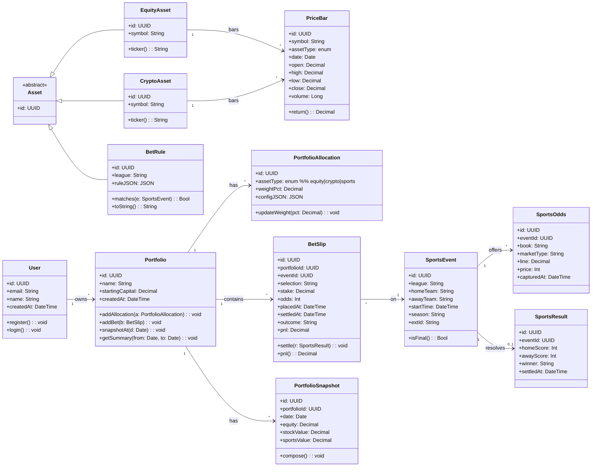
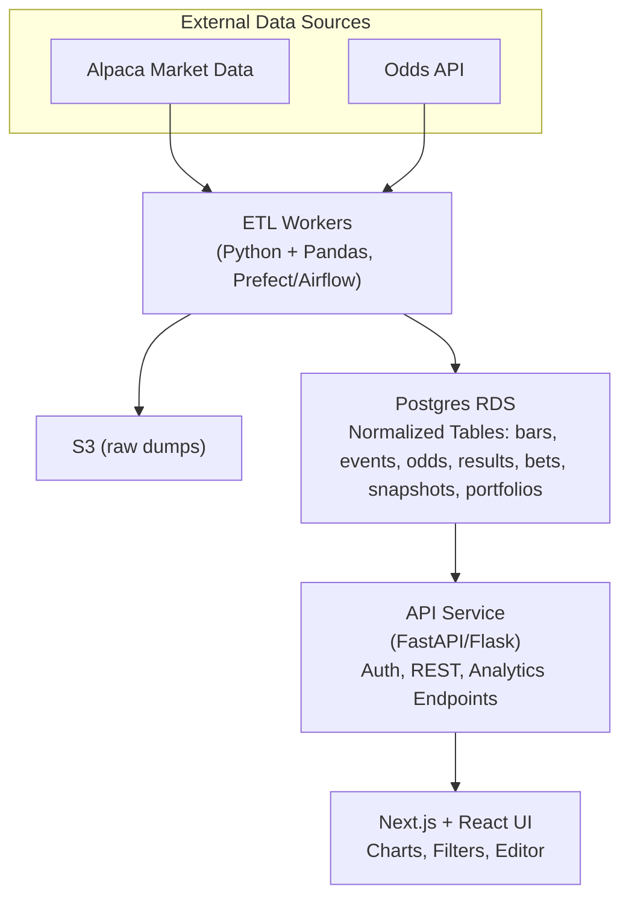

# Stake N' Shares: Where Markets Meet Matches.

[](https://opensource.org/licenses/MIT)    


> **TL;DR**: a cross-domain analytics dashboard that compares how your money performs in two high-variance worlds: traditional markets and sports wagers. By pulling in equities, ETFs, and crypto alongside NBA, NFL, and soccer bets, the platform normalizes data into a single portfolio view. Users can track ROI, volatility, and Sharpe ratios side-by-side, gaining insights into whether the stock market or the sportsbook delivers a better edge

---

## Table of Contents
- [Product Vision](#product-vision)
- [Key Use Cases](#key-use-cases)
- [Core Features](#core-features)
- [Tech Stack](#tech-stack)
- [MVP (Must-Have)](#mvp-must-have)
- [Stretch Features](#stretch-features)

---

## Product Vision
A personal investment + betting analytics dashboard that allows users to **simulate, track, and analyze** how their money performs across two high-variance domains:

- **Traditional markets**: stocks, ETFs, crypto  
- **Sports wagers**: NBA, NFL, soccer bets, etc.

The platform helps users see how **betting strategies** stack up against **investing strategies**, with insights into **ROI**, **volatility**, and **risk-adjusted performance**.

<!-- Placeholder for 3 images in a row (flexbox, center, space around, equal size) representing mockups -->
<!-- ...existing code... -->
|  |  |  |
|---:|:---:|:---|
| Analytics dashboard | Recent activity | Market data |
|  |  |  |
| Sporting events | Watchlist | Performance reports |
<!-- ...existing code... -->


---

## Key Use Cases
- **Investor → Betting curiosity**  
  Allocate a percentage of a portfolio to sports bets and compare against equities (e.g., SPY).

- **Bettor → Investing curiosity**  
  Track betting slips side-by-side with stock performance for consistency checks.

- **Analytics enthusiast**  
  Experiment with alternative allocations (e.g., “my bets outperformed my crypto last month”).

- **Recruiter/Employer showcase**  
  Demonstrates ETL across domains, data normalization, analytics, and a clean UI.

---

## Core Features

### MVP (Must-Have)

**ETL Pipelines**
- Ingest daily **stock/crypto** data (e.g., *Alpaca* / *Alpha Vantage*).
- Ingest **sports odds & results** (e.g., *The Odds API*, *Sportradar*, *NBA API*).
- Normalize datasets → store in **PostgreSQL**.

**Analytics Layer**
- Portfolio **ROI** comparisons (stocks vs. bets).
- **Volatility**, **Sharpe ratio**, **win %**.
- **Cumulative growth** over time.

**Frontend Dashboard (React/Next.js)**
- **Side-by-side charts**: stock portfolio vs. betting portfolio.
- **Filters**: timeframe (last 30 days, last season), category (NFL, NBA, crypto).

**MVP Checklist**
- [ ] Stock/crypto ETL job (EOD)  
- [ ] Sports events/odds/results ETL  
- [ ] Normalized schema in Postgres  
- [ ] ROI/volatility/Sharpe calculators  
- [ ] Equity curve endpoints (API)  
- [ ] React dashboard with compare view & filters

### Stretch Features
- **Simulated Allocation**  
  User-defined inputs (e.g., `$5k`, `80%` stocks / `20%` NFL bets) → historical performance simulation.

- **Predictive Layer**  
  Simple ML regression to surface undervalued **odds** or **equities**.

- **Social/Sharing**  
  Export report (e.g., “My bets vs. S&P 500”) to **CSV/PDF**.

---

## Tech Stack

**Data Engineering**
- Python, Pandas (ETL)
- Airflow / Prefect (orchestration – bonus)
- PostgreSQL (storage)

**APIs**
- Alpaca / Alpha Vantage → stocks, ETFs, crypto
- The Odds API / Sportradar / NBA API → sports odds & outcomes

**Analytics**
- NumPy, SciPy (ROI, volatility, Sharpe)
- scikit-learn (stretch ML)

**Frontend**
- Next.js + React
- Recharts / D3.js (visualizations)

**Deployment**
- Dockerized services
- AWS (RDS, S3, EC2) **or** Vercel/Render (frontend)

---

## Project Structure

```
cross-domain-portfolio/
├─ README.md
├─ LICENSE
├─ .gitignore
├─ .env.example
├─ docker-compose.yml
├─ Makefile                      # common dev tasks (make up, make test, etc.)
│
├─ docs/
│  ├─ DECK.md                    # the text deck you requested
│  ├─ API.md                     # endpoint details + examples
│  ├─ DATA_SOURCES.md            # Alpaca + Odds API notes, limits
│  ├─ ARCHITECTURE.md            # diagrams, decisions
│  └─ ERD.png                    # optional rendered diagram (if you export)
│
├─ infra/
│  ├─ docker/
│  │  ├─ api.Dockerfile
│  │  ├─ etl.Dockerfile
│  │  └─ frontend.Dockerfile
│  ├─ k8s/                       # optional if you show k8s manifests
│  │  ├─ api-deployment.yaml
│  │  ├─ api-service.yaml
│  │  └─ postgres-statefulset.yaml
│  └─ terraform/                 # optional infra-as-code stub
│     └─ main.tf
│
├─ backend/                      # FastAPI (Python)
│  ├─ app/
│  │  ├─ main.py                 # FastAPI entry
│  │  ├─ config.py               # env, settings
│  │  ├─ deps.py                 # dependencies (DB sessions, auth)
│  │  ├─ db/
│  │  │  ├─ base.py              # Base = declarative_base()
│  │  │  ├─ session.py           # engine/session creation
│  │  │  └─ migrations/          # alembic migrations
│  │  ├─ models/                 # SQLAlchemy models
│  │  │  ├─ user.py
│  │  │  ├─ portfolio.py
│  │  │  ├─ allocation.py
│  │  │  ├─ asset.py             # EquityAsset/CryptoAsset/BetRule
│  │  │  ├─ pricebar.py
│  │  │  ├─ sports_event.py
│  │  │  ├─ sports_odds.py
│  │  │  ├─ sports_result.py
│  │  │  ├─ bet_slip.py
│  │  │  └─ snapshot.py
│  │  ├─ schemas/                # Pydantic
│  │  │  ├─ user.py
│  │  │  ├─ portfolio.py
│  │  │  ├─ allocation.py
│  │  │  ├─ analytics.py
│  │  │  └─ common.py
│  │  ├─ api/                    # routers
│  │  │  ├─ v1/
│  │  │  │  ├─ auth.py
│  │  │  │  ├─ portfolios.py
│  │  │  │  ├─ allocations.py
│  │  │  │  ├─ market.py         # read-only bars from DB
│  │  │  │  ├─ sports.py         # events/odds/results from DB
│  │  │  │  ├─ bets.py
│  │  │  │  ├─ analytics.py      # ROI/Sharpe/curves endpoints
│  │  │  │  └─ reports.py
│  │  ├─ services/
│  │  │  ├─ analytics.py         # ROI, volatility, Sharpe, corr
│  │  │  ├─ portfolio_calc.py    # daily equity, snapshots
│  │  │  └─ reporting.py         # CSV/PDF generation (if done server-side)
│  │  └─ utils/
│  │     ├─ time.py              # UTC/buckets
│  │     ├─ math.py              # helpers (drawdown, returns)
│  │     └─ security.py          # JWT (if used)
│  ├─ tests/
│  │  ├─ test_api_analytics.py
│  │  ├─ test_portfolios.py
│  │  └─ test_services.py
│  └─ pyproject.toml / requirements.txt
│
├─ etl/                          # Ingestion + normalization
│  ├─ pipelines/
│  │  ├─ alpaca_equities.py      # bars/trades/quotes → pricebar table
│  │  ├─ alpaca_positions.py     # optional (paper PnL path)
│  │  ├─ odds_events.py          # schedule/events
│  │  ├─ odds_lines.py           # odds for events
│  │  └─ sports_results.py       # final scores/winners
│  ├─ transforms/
│  │  ├─ normalize_bars.py
│  │  ├─ normalize_odds.py
│  │  └─ join_events_results.py
│  ├─ scheduler/
│  │  ├─ prefect_flows.py        # or airflow_dags.py
│  │  └─ cron.md
│  ├─ common/
│  │  ├─ db.py                   # SQLAlchemy engine reuse
│  │  ├─ clients/
│  │  │  ├─ alpaca_client.py
│  │  │  └─ odds_client.py
│  │  └─ logging.py
│  └─ tests/
│     └─ test_normalizations.py
│
├─ frontend/                     # Next.js + React
│  ├─ app/ or src/               # depending on Next.js version
│  │  ├─ pages/ (or app/)
│  │  │  ├─ index.tsx            # Dashboard (compare view)
│  │  │  ├─ portfolio.tsx        # Editor
│  │  │  ├─ data-browser.tsx
│  │  │  └─ reports.tsx
│  │  ├─ components/
│  │  │  ├─ KPIs.tsx
│  │  │  ├─ EquityChart.tsx
│  │  │  ├─ SportsChart.tsx
│  │  │  ├─ AllocationSlider.tsx
│  │  │  ├─ Table.tsx
│  │  │  └─ Layout.tsx
│  │  ├─ lib/
│  │  │  ├─ api.ts               # fetchers for backend
│  │  │  └─ format.ts            # number/date formatters
│  │  ├─ styles/
│  │  │  └─ globals.css
│  │  └─ types/
│  │     └─ index.ts
│  ├─ public/
│  ├─ next.config.js
│  └─ package.json
│
└─ scripts/
   ├─ dev_up.sh                   # docker compose up + seed
   ├─ seed_db.py                  # insert demo data
   └─ export_report.py            # CLI report exporter (optional)
```

---

## UML Class Diagram


---

## Architecture Diagram


---

## API Endpoints Summary


| Area            | Method | Path                                                  | Purpose                                    |
| --------------- | ------ | ----------------------------------------------------- | ------------------------------------------ |
| **Auth**        | POST   | `/api/auth/login`                                     | Obtain JWT                                 |
| **Portfolio**   | GET    | `/api/portfolios`                                     | List portfolios                            |
|                 | POST   | `/api/portfolios`                                     | Create portfolio                           |
|                 | GET    | `/api/portfolios/:id`                                 | Get portfolio                              |
|                 | PATCH  | `/api/portfolios/:id`                                 | Update portfolio                           |
| **Allocations** | GET    | `/api/portfolios/:id/allocations`                     | List allocations for a portfolio           |
|                 | POST   | `/api/portfolios/:id/allocations`                     | Add allocation rule (stocks/crypto/sports) |
|                 | DELETE | `/api/allocations/:allocId`                           | Remove allocation                          |
| **Market**      | GET    | `/api/market/equities/:symbol/bars?from=&to=&tf=1d`   | OHLCV bars from DB                         |
|                 | GET    | `/api/market/crypto/:symbol/bars?from=&to=&tf=1d`     | Crypto bars from DB                        |
| **Sports**      | GET    | `/api/sports/events?league=NBA&from=&to=`             | Events by league/date                      |
|                 | GET    | `/api/sports/events/:eventId/odds`                    | Odds for an event                          |
|                 | GET    | `/api/sports/events/:eventId/result`                  | Final result for an event                  |
| **Bets**        | GET    | `/api/portfolios/:id/bets?from=&to=`                  | List bets                                  |
|                 | POST   | `/api/portfolios/:id/bets`                            | Record/simulate a bet                      |
| **Analytics**   | GET    | `/api/analytics/portfolio/:id/summary?from=&to=`      | ROI, Sharpe, correlation, drawdowns        |
|                 | GET    | `/api/analytics/portfolio/:id/equity-curve?from=&to=` | Daily equity curve                         |
|                 | POST   | `/api/analytics/simulate`                             | Run simulated allocation                   |
| **Reports**     | GET    | `/api/reports/portfolio/:id?format=csv&from=&to=`     | Export report (CSV)                        |
